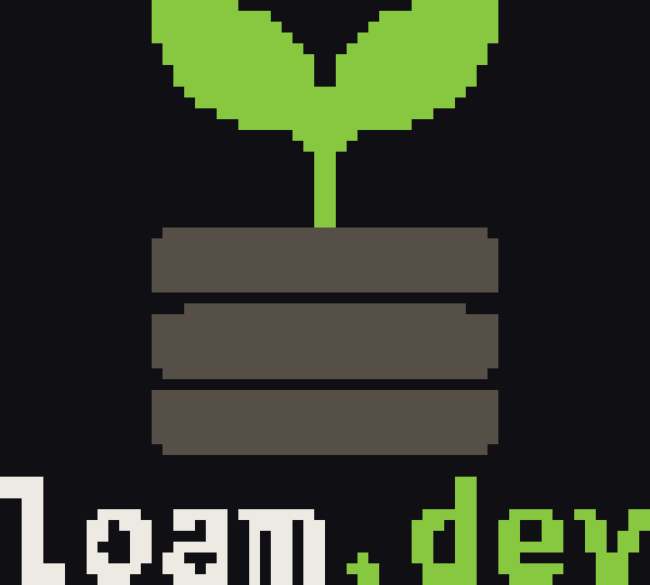

<p align="center">
  
</p>

<p align="center">
  <strong>Codebase intelligence &amp; anti-AI-slop for Dart &amp; Flutter.</strong>
</p>

<p align="center">
  Catch the <em>structural drift</em> and <em>AI-generated slop</em> that
  <code>dart analyze</code> never sees — behind a baseline/ratchet CI gate that
  never paints a grown codebase red on day one.
</p>

<p align="center">
  <a href="https://pub.dev/packages/loam"></a>
  
  
  
</p>

> **loam.dev** is the product; **`loam`** is the CLI command and the pub.dev
> package name. Built on the Dart `analyzer` package — semantically accurate,
> project-wide, offline by default.

---

## Why loam.dev?

AI coding agents generate Dart/Flutter faster than anyone can review. Two classes
of damage slip straight past the built-in `dart analyze`:

1. **Structural drift** — dead code, duplication, circular dependencies,
   complexity hotspots, violated architecture boundaries.
2. **AI-slop** — empty `catch` blocks, narrative filler comments, ungrounded
   `// ignore:`, duplicated helpers, dead guard clauses, hallucinated abstractions.

JS/TS has mature tools for this. **Dart/Flutter has had nothing free and
slop-aware** — the closest is DCM, but its best rules sit behind a commercial
license and it has no LLM-backed slop detection. loam.dev closes that gap.

## What it catches

**Available now (0.1.0):** project-wide **unused public API** — exports, classes,
methods, getters/setters and fields that nothing in the project references —
on the resolved Dart element model (not regex), behind the baseline/ratchet gate.

Everything else is the **target surface**: each lands as one plugin behind a
single, stable `Rule` interface, so adding a feature never changes the pipeline
(🚧 = planned, not yet in 0.1.0).

| Structural drift (deterministic, semantic) | AI-slop (deterministic **+** optional LLM) |
|---|---|
| ✅ Unused public exports, files, members | 🚧 Empty / swallowing `catch` blocks |
| 🚧 Circular dependencies | 🚧 Narrative filler comments |
| 🚧 Code duplication (AST-normalised) | 🚧 Ungrounded `// ignore:` |
| 🚧 Complexity hotspots + health score | 🚧 Duplicated helpers, dead guards |
| 🚧 Architecture-boundary violations | 🚧 Hallucinated / superfluous abstractions |

## What makes it different

- **🌱 Semantic, not regex.** Structural rules use the resolved Dart element
  model and project-wide graphs — real whole-program resolution, not heuristics.
  *(live in 0.1.0)*
- **🔒 Baseline / ratchet gate (the default).** Freeze today's accepted findings;
  from then on only **new** findings fail CI. Monotone improvement, no day-one red.
  *(live in 0.1.0)*
- **📦 Dart-native.** Installed via `dart pub global activate loam`. SemVer;
  `ruleset@ver` is part of the baseline identity (`prompt@ver` joins it with the
  LLM layer). *(live in 0.1.0)*
- **♻️ Reproducible, even with an LLM.** The LLM proposes `{score, label}` →
  cached by `sha(code)+prompt@ver` → fixed thresholds decide. Same code = cache
  hit = stable verdict = zero token cost. No flaky gate. *(🚧 planned)*
- **📄 Self-contained HTML report.** A single offline `.html` artifact: browse
  findings by rule, severity, or file — no server, no hosting. Redirect stdout
  with `loam scan --format html > loam-report.html`. *(live in 0.1.3)*

## Quick start

> 🚧 **0.1.0 — early preview.** The first functional release ships one
> end-to-end rule (`unused-public-exports`); the remaining capabilities land as
> individual rules. Commands marked *coming soon* are wired in `loam --help` but
> not yet implemented.

### Install

**Homebrew (Apple Silicon macOS & Linux — recommended).** No `PATH` setup, lands
on a directory that is already on your `PATH`:

```bash
brew install silvio-l/loam/loam
```

`brew upgrade loam` updates it. (Intel Macs: use the Dart pub path below.)

**Dart pub (all platforms).** The pub.dev package:

```bash
dart pub global activate loam
```

This installs into `$HOME/.pub-cache/bin`, which is **not** on your `PATH` by
default — Dart prints a reminder if it isn't. The `export` line it shows only
lasts for the current shell; make it permanent by adding it to your shell config
**once**:

<details>
<summary>Put <code>~/.pub-cache/bin</code> on your <code>PATH</code> permanently</summary>

```bash
# zsh (macOS default)
echo 'export PATH="$PATH:$HOME/.pub-cache/bin"' >> ~/.zshrc && source ~/.zshrc

# bash
echo 'export PATH="$PATH:$HOME/.pub-cache/bin"' >> ~/.bashrc && source ~/.bashrc
```
</details>

**To update**, re-run `dart pub global activate loam`.

<details>
<summary>Install the unreleased <code>dev</code> branch instead</summary>

```bash
dart pub global activate --source git https://github.com/silvio-l/loam.git \
    --git-path packages/loam_cli --git-ref dev
```
</details>

### Use

Available now (tracer rule `unused-public-exports`):

```bash
loam scan                          # full audit: unused public API, whole repo
loam baseline --write              # freeze the remaining, accepted state
loam gate                          # CI from now on — ratchet: only new findings fail
```

Initialise configuration:

```bash
loam init                          # scaffold loam.yaml config in the project
```

Coming soon (wired in `loam --help`, not yet implemented):

```bash
loam health                        # project health score: complexity, drift, slop
loam slop                          # AI-slop audit: slop-focused rules only
loam fix --safe                    # apply mechanical fixes
```

**Onboarding an existing repo** (turn an established codebase green, then keep it
green): `scan` → clean up → `baseline --write` → `gate` in CI. A later cleanup
round just repeats it. Greenfield? `loam gate --absolute` needs no baseline.

**Update notice.** loam.dev checks pub.dev at most once a day and, when a newer
release exists, prints one line to stderr *after* the command output — never to
stdout, never touching the exit code. Silence it per run with `--no-update-check`,
machine-wide with the `LOAM_NO_UPDATE_CHECK` environment variable, or repo-wide
with `update_check: false` in `loam.yaml`. CI is always silent.

## Built for the terminal

<p align="center">
  
</p>

Machine-readable output for CI and agents, a human-readable report for you:

```
--format human        # default, readable terminal output      (available)
--format sarif        # CI / code-scanning                      (available)
--format json         # agent / tooling integration             (available)
--format markdown     # PR / docs embedding                     (available)
--format html         # interactive, self-contained report      (available)
```

## Status & roadmap

**0.1.0 preview** — one rule (`unused-public-exports`) live end to end; the rest
of the capabilities land as individual rules.

For a detailed walkthrough of concepts, CLI commands, output formats, and codegen
handling, see the **[Developer & Tool Guide](./docs/developer-guide.md)**.

## Repo layout

This is a monorepo — everything that makes up loam.dev:

| Path | What |
|---|---|
| [`packages/loam_cli/`](./packages/loam_cli/) | The Dart CLI (pub.dev package `loam`). The actual tool. |
| [`web/`](./web/) | Promo / docs website (static, multipage, EN/DE, free-tier). See its [README](./web/README.md). |
| [`skill/`](./skill/) | Claude skill/plugin that drives `loam` for agents. Scaffold. |
| [`assets/brand/`](./assets/brand/) | Logo, colors, terminal banner. See its [README](./assets/brand/README.md). |
| [`docs/`](./docs/) | Developer & tool guide. |

### Website routes (`web/`)

The site is multilingual (EN default at root, DE under `/de/`) with 8 pages:

| EN route | DE route | Content |
|---|---|---|
| `/` | `/de/` | Home — hero, install, GitHub-Stars CTA |
| `/how-it-works` | `/de/how-it-works` | Pipeline walkthrough |
| `/rules` | `/de/rules` | Rule catalogue (live + planned) |
| `/privacy` | `/de/privacy` | Privacy policy |

All pages share a single `Layout.astro` (brand tokens, hreflang alternates, footer).
Font: self-hosted `@fontsource/spline-sans-mono` (no Google CDN).
Sitemap: `@astrojs/sitemap` (documented exception — deterministic static XML, no runtime service).

## Develop

The Dart package lives in `packages/loam_cli/`:

```bash
cd packages/loam_cli
dart pub get
dart format --output=none --set-exit-if-changed bin lib test
dart analyze --fatal-infos --fatal-warnings
dart test
dart run bin/loam.dart scan
```

loam.dev's first test target is **its own codebase** — the tool that finds slop
and drift must carry none itself.

## License

MIT © 2026 Silvio Lindstedt
